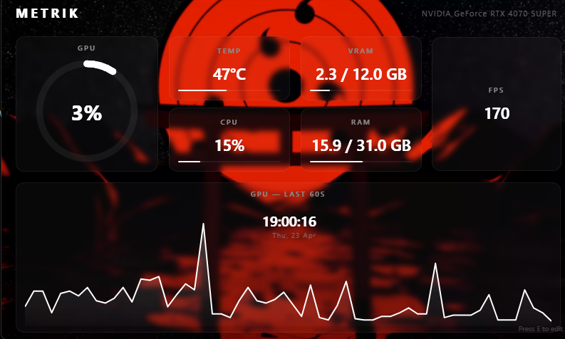
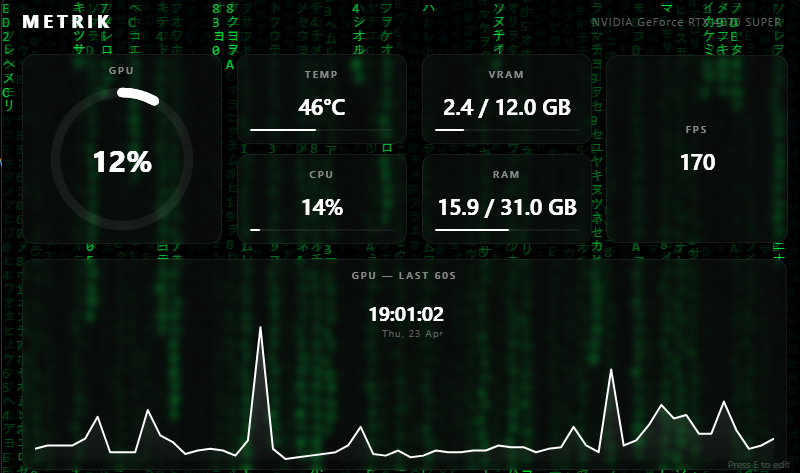
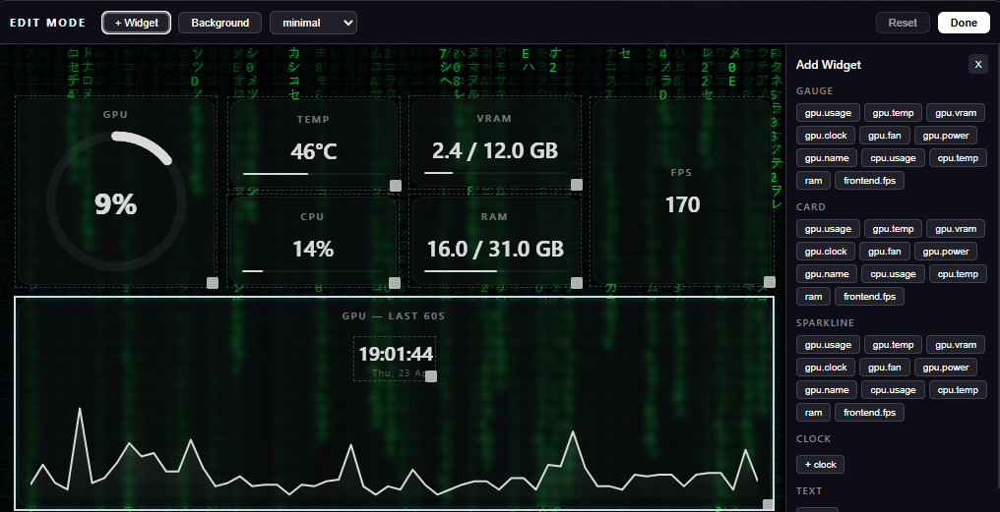

# Metrik

<p align="center">
  
</p>

<p align="center">
  A customizable desktop metrics panel built with Tauri + React.
</p>

Metrik is a fast, always-on-top system monitor designed for builders who want both clean visuals and deep customization. It ships with real-time GPU/CPU/system stats, editable dashboard widgets, themes, and an extension-friendly architecture.

## Screenshots



*Dashboard overview with live widgets and theme styling.*



*Alternate dashboard configuration view.*



*Edit mode with drag/resize controls for dashboard customization.*

## Why Metrik

- Real-time metric snapshots streamed from Rust providers to a React UI.
- Flexible widget dashboard with drag, resize, and quick edit mode.
- Theme + background customization for clean desktop integration.
- Tauri-native desktop app (lightweight compared to Electron stacks).
- Mod-friendly structure for custom widgets, providers, themes, and layouts.

## Features

- Live metrics polling (currently NVML + system info providers).
- Built-in widget types:
  - Gauge
  - Card
  - Sparkline
  - Clock
  - Text
- Persistent config for layout, theme, background, and window position.
- Multi-monitor quick cycle support.
- Keyboard-first controls for fast interaction.

## Tech Stack

- **Desktop Runtime:** Tauri v2 (Rust backend + web frontend)
- **Frontend:** React + TypeScript + Vite
- **Backend:** Rust providers + event emitter loop
- **Storage:** Tauri Store plugin (`config.json`)

## Quick Start

### Prerequisites

- Node.js (LTS recommended)
- Rust toolchain
- Tauri build prerequisites for your OS

Reference: [Tauri prerequisites](https://tauri.app/start/prerequisites/)

### Install and run

```bash
npm install
npm run tauri dev
```

### Build release

```bash
npm run build
npm run tauri build
```

## Developer Workflow

- `npm run dev` - Frontend only (Vite).
- `npm run tauri dev` - Full desktop app in development.
- `npm run build` - Frontend production bundle.
- `npm run tauri build` - Desktop installers/bundles.

## Build Your Own Mods/Widgets

Want to extend Metrik with your own UI components or metric providers?

Use the dedicated developer guide in:

- `[src/mods/README.md](./src/mods/README.md)`

That doc covers:

- Custom React widget creation + registry wiring
- Custom Rust metric providers
- Theme and layout extension patterns

## Contributing

Contributions are welcome. If you are adding features, try to keep PRs small and focused:

1. Fork the repo and create a feature branch.
2. Make changes with clear scope.
3. Test with `npm run tauri dev`.
4. Submit a PR with screenshots/gifs for UI changes.

Ideas that are especially welcome:

- New widgets and layouts
- Additional metric providers
- Performance and rendering improvements
- Better onboarding docs and examples

## Roadmap Direction

- More widget templates
- Expanded hardware/software metrics
- Preset sharing
- Plugin/mod quality-of-life tooling

## License

MPL v2