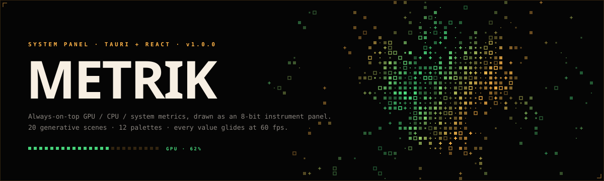
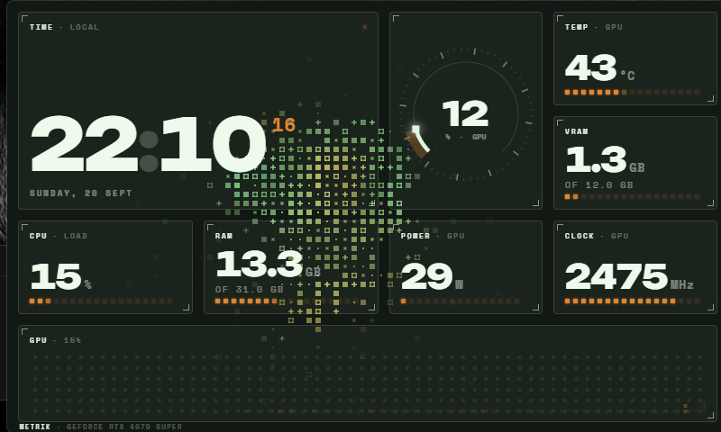
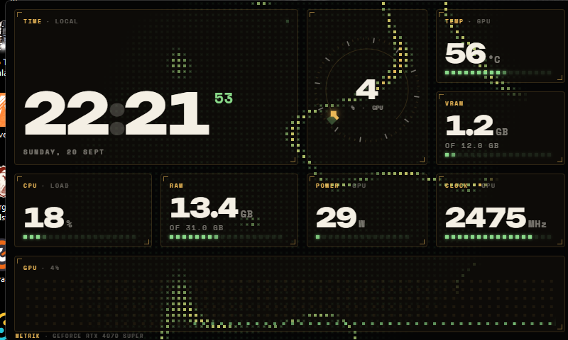
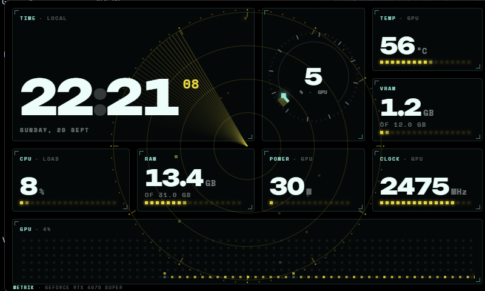
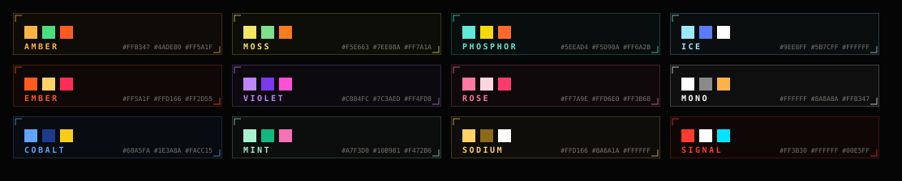

<p align="center">
  
</p>

<p align="center">
  <sub><b>ALWAYS-ON-TOP · GPU / CPU / SYSTEM · TAURI v2 + REACT · WINDOWS x64</b></sub>
</p>

<p align="center">
  <a href="https://github.com/PSNAppz/Metrik/releases"></a>
  
  
  
</p>

Metrik is an 800×480 instrument panel for your desk: live GPU, CPU and memory readings drawn as an 8-bit HUD, sitting on top of a generative background that reacts to load. It is built for people who want a second-screen or corner-of-the-monitor readout that looks like it belongs on hardware, not in a browser tab.

<p align="center">
  
  <br><sub>MOSS · GLYPH CLUSTER</sub>
</p>

<table>
  <tr>
    <td><br><sub align="center">AMBER · PIXEL FLOW</sub></td>
    <td><br><sub align="center">PHOSPHOR · SONAR SWEEP</sub></td>
  </tr>
</table>

## What's in 1.0

Version 1.0 is a ground-up rebuild of the visual layer. Every value on screen now glides between samples at 60 fps instead of jumping once a second; the glassy card look is gone in favour of a dot-matrix instrument aesthetic.

| | |
|---|---|
| **Typography** | [Unbounded](https://fonts.google.com/specimen/Unbounded) 800 for numerals, [Space Mono](https://fonts.google.com/specimen/Space+Mono) for labels — bundled, no network needed |
| **Motion** | Metric values, gauge needles and meter dots ease toward new samples; the sparkline scrolls continuously and the clock's colon blinks |
| **Tiles** | Hairline outlines, HUD corner brackets, tiny uppercase captions (`TEMP · GPU`), LED dot meters that turn red past 88 % |
| **Gauge** | Dial ring with a slowly rotating tick ring, sweeping arc, glowing head and translucent trailing band |
| **Sparkline** | 60-sample dot-matrix chart; the newest column slides in and eases to height |
| **Scenes** | 20 canvas-drawn backgrounds, all reacting to `gpu.usage`, `gpu.temp` and `gpu.vram` |
| **Palettes** | 12 named colour triples, applied to any scene from the picker |
| **Themes** | `amber`, `moss`, `phosphor` — colours for text, tiles and outlines |
| **Perf** | No `backdrop-filter`, no `transition: all`; canvases pause when the window is hidden |

## Scenes

Every scene is a pure `draw(frame, signals)` function in [`src/scenes/`](./src/scenes/). `signals` carries three smoothed 0–1 values — **load** (GPU usage), **heat** (GPU temp, 30 °C → 90 °C) and **mem** (VRAM fill) — so a scene gets busier, warmer or wider as the machine works.

| Scene | What moves | Driven by |
|---|---|---|
| Glyph Cluster | Breathing blob of squares, rings and crosses | load swells it, heat warms it |
| Pixel Flow | Dot-matrix field with luminous streams | load speeds the streams, mem widens the field |
| Halftone Bloom | Dot rings pulsing outward like a heartbeat | pulse rate |
| Spectrum Wall | Equaliser-style bank of pixel bars | amplitude, hot-line height |
| Orbit Lattice | 3D sphere of pixel dots on a tilted spin | spin speed, radius |
| Glyph Ticker | Rows of glyphs scrolling like punched tape | tape speed |
| Contour Terrain | Topographic contour lines of a drifting height field | drift, elevation |
| Pixel Aurora | Bayer-dithered light curtains from the top edge | brightness, tint |
| Cellular Drift | Game of Life with phosphor trails | step rate, birth rate |
| Sonar Sweep | Rotating beam over a ringed dial; blips flare as it passes | contact count |
| Dither Swell | Stacked sine swells as dithered bands — a 1-bit ocean | wave height |
| Warp Field | Pixel starfield streaming from a drifting vanishing point | warp speed |
| Circuit Trace | PCB-style traces with pulses travelling along them | pulses in flight |
| Isometric Field | Grid of isometric pixel cubes riding a noise heightmap | churn |
| Moiré Rings | Two ring families drifting; interference blooms where they cross | drift, spacing |
| Rainfall Pool | Dot columns fall and pool into a settling meniscus | rain density |
| Barcode Drift | Sliding barcode bars under a scanner line | scroll speed |
| Glitch Blocks | Calm mosaic that occasionally tears sideways | tear frequency |
| 8-bit Dust | Pixel-snapped square particles that twinkle | energy |
| Matrix Rain | Falling glyph columns | drop rate |

Plus media backgrounds: solid, animated gradient, image, video, or a muted YouTube embed.

## Palettes

<p align="center">
  
</p>

Each palette is a `[primary, secondary, tertiary]` triple. In the Background picker you choose a palette once, then any scene you pick takes it; switching palette recolours the current scene in place. Palettes live in [`src/editor/scene-presets.ts`](./src/editor/scene-presets.ts) — adding one is a single line.

## Widgets

| Type | Shows |
|---|---|
| `gauge` | Dial ring with numeral, unit and label |
| `card` | Stat tile: numeral, unit, secondary line (e.g. `OF 12.0 GB`), LED dot meter |
| `sparkline` | Dot-matrix history of the last 60 samples |
| `clock` | Big local time with seconds and a mono date line |
| `text` | Free text in the display face |
| `gamefps` | Detected game, FPS, CPU and memory (FPS needs admin) |
| `youtube` `discord` `steam` | Channel / presence / playtime cards (configured under **Integrations**) |

Metrics available to `gauge`, `card` and `sparkline`: `gpu.usage` `gpu.temp` `gpu.vram` `gpu.clock` `gpu.fan` `gpu.power` `gpu.name` `cpu.usage` `cpu.temp` `ram` `frontend.fps` `game.*`.

## Controls

| Key | Action |
|---|---|
| <kbd>E</kbd> | Enter edit mode — drag, resize, add widgets, pick scenes and palettes, save 3 style presets |
| <kbd>Esc</kbd> | Leave edit mode, or quit when not editing |
| <kbd>Delete</kbd> | Remove the selected widget (edit mode) |
| <kbd>M</kbd> | Move the panel to the next monitor |
| <kbd>Ctrl</kbd>+<kbd>Q</kbd> | Quit |

The window position, layout, background, overlay, theme and presets persist in `%APPDATA%\com.metrik.panel\config.json`.

## Install

Download the installer from [Releases](https://github.com/PSNAppz/Metrik/releases):

- `Metrik_1.0.0_x64-setup.exe` — NSIS installer (recommended)
- `Metrik_1.0.0_x64_en-US.msi` — MSI package

Requires an NVIDIA GPU with current drivers for the `gpu.*` metrics (NVML). CPU, RAM and clock widgets work on any machine. Run as Administrator if you want in-game FPS.

## Build from source

Prerequisites: Node.js LTS, the Rust toolchain, and the [Tauri prerequisites](https://tauri.app/start/prerequisites/) for Windows.

```bash
npm install
npm run tauri dev      # full desktop app, hot reload
npm run tauri build    # installers in src-tauri/target/release/bundle/
```

| Script | Purpose |
|---|---|
| `npm run dev` | Vite only (no Tauri APIs) |
| `npm run build` | Frontend production bundle |
| `npm run tauri dev` | Desktop app in development |
| `npm run tauri build` | Release installers |

To iterate on a widget without the Rust side, open `http://localhost:5173/src/dev/harness.html` under `npm run dev` — it renders the sparkline, card and gauge against a fake metric stream.

## Architecture

```
src-tauri/          Rust: NVML + sysinfo providers, 1 s snapshot loop, config store, integrations
src/
  anim/             useSmoothValue (eased numbers), useCanvasLoop (DPR-aware rAF loop)
  scenes/           noise + palette primitives, SceneCanvas, one file per scene, registry
  widgets/          Card, Gauge, Sparkline, Clock, Text, DotMeter, shared metric formatting
  editor/           Toolbar, property panel, widget palette, background picker, scene presets
  layouts/          Default bento layout + LAYOUT_VERSION
  themes/           amber / moss / phosphor
  mods/             Integration widgets (YouTube, Discord, Steam, game FPS)
```

Snapshots arrive once a second on the `metrics` event; `useMetrics` keeps the current value and a 60-sample history per key. Widgets read them through `MetricsContext` and animate toward each new sample rather than rendering it directly.

## Extend it

- **New scene:** add `src/scenes/yourScene.ts` exporting `(colors: string[], speed?: number) => Scene`, register it in [`registry.ts`](./src/scenes/registry.ts), add a row in [`scene-presets.ts`](./src/editor/scene-presets.ts). Reuse `noise3`, `noise3o2`, `cellRand`, `smoothstep` and the palette helpers.
- **New palette:** one entry in `PALETTES`.
- **New widget or provider:** see [`src/mods/README.md`](./src/mods/README.md).

## Contributing

PRs welcome — keep them focused, test with `npm run tauri dev`, and include a screenshot or clip for anything visual. Good first targets: new scenes, new metric providers, layout templates.

## License

[MPL-2.0](./LICENSE.md)
